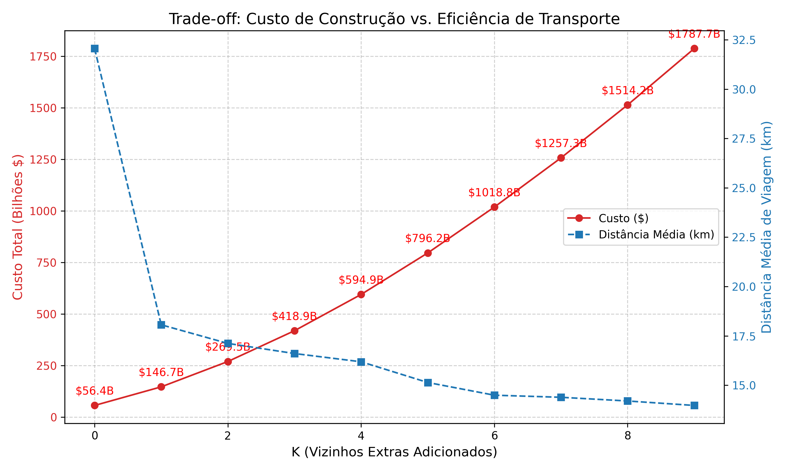
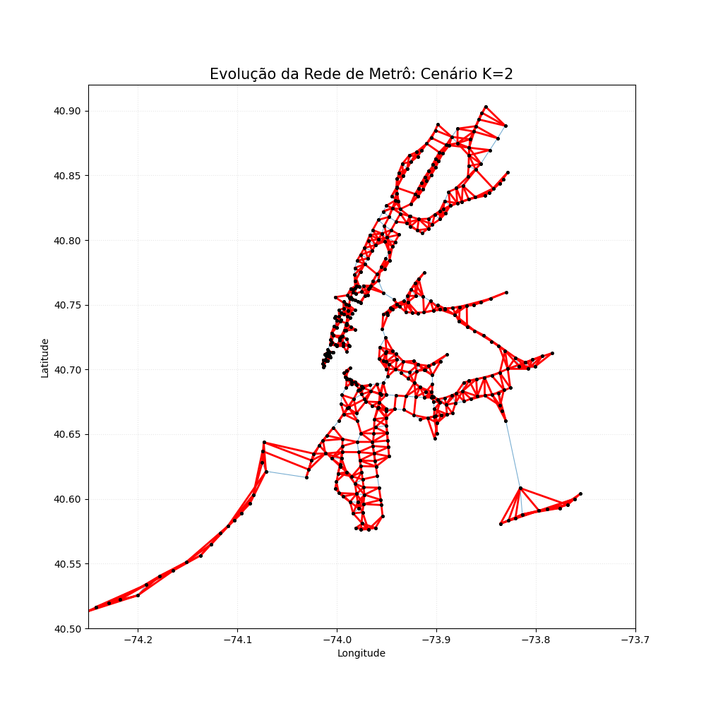
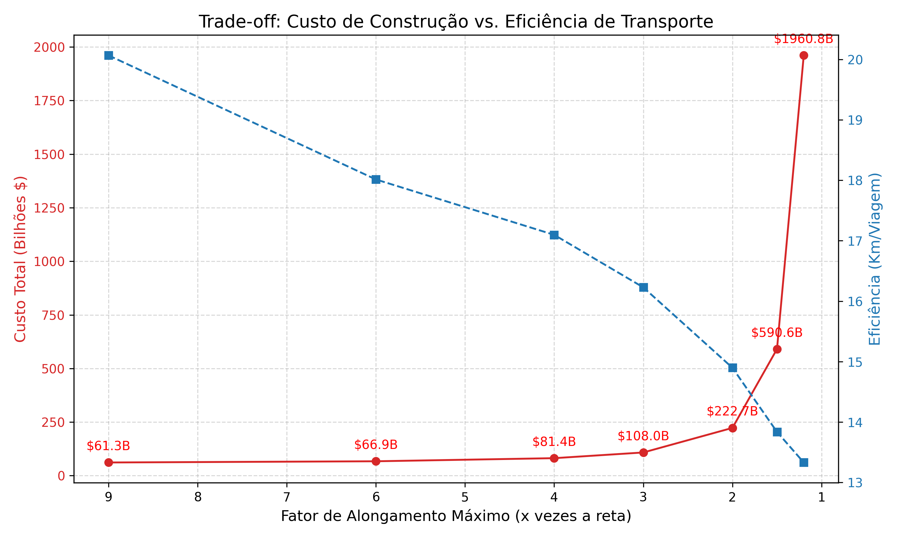
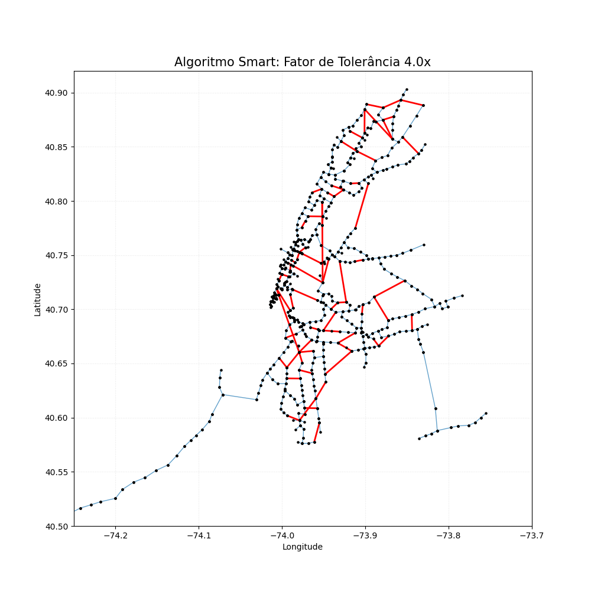

# 🚇 NY Subway Network Analyzer - Otimização de Grafos

> Trabalho Final da disciplina de Algoritmos e Estruturas de Dados 2 (AED2)
> Instituto de Informática - UFG

Este projeto aplica conceitos avançados de **Teoria dos Grafos** para propor e analisar redesigns da malha metroviária de Nova York. O objetivo é encontrar o equilíbrio ideal entre **Custo de Construção** e **Eficiência de Transporte** (Tempo de Viagem).

---

## 🎯 O Problema

O metrô de Nova York possui 496 estações. Conectar todas elas com túneis diretos seria infinitamente caro. Conectá-las com o mínimo de trilhos possível (MST) tornaria as viagens muito longas.

Nossa solução simula diferentes cenários de construção:
1.  **Cenário Base (K=0):** Geramos uma **Árvore Geradora Mínima (MST)** que conecta todas as estações com o menor custo financeiro possível.
2.  **Cenários Otimizados (K > 0):** Adicionamos conexões estratégicas para os **K vizinhos geográficos mais próximos** de cada estação, aumentando o custo, mas reduzindo drasticamente o tempo médio de viagem.

O programa calcula métricas financeiras (bilhões de dólares) e de eficiência (km/viagem) para determinar o ponto de inflexão (melhor custo-benefício).

---

## 🛠️ Tecnologias e Algoritmos

O núcleo do projeto foi desenvolvido em **C++ Moderno (C++17)** visando alta performance.

### Algoritmos Implementados
* **Kruskal's Algorithm:** Para geração da espinha dorsal da rede (MST) com custo mínimo.
* **Dijkstra's Algorithm:** Executado a partir de cada nó para calcular a "Distância Média Global" da rede (eficiência).
* **Union-Find (Disjoint Set Union):** Implementado com otimizações de *Path Compression* e *Union by Rank* para suportar o Kruskal.
* **Haversine Formula:** Para cálculo preciso de distâncias geográficas (em km) considerando a curvatura da Terra.
* **K-Nearest Neighbors (KNN):** Lógica gulosa para inserção de atalhos na rede.

---

## 🚀 Como Executar

### Pré-requisitos
* **Compilador C++:** `g++` com suporte a C++17.
* **Make:** Para automação da compilação.
* **Python 3** (Opcional): Para geração dos gráficos visuais.

### Passo a Passo

1.  **Clone o repositório:**
    ```bash
    git clone [https://github.com/lboclin/trabalho-aed2-metro.git](https://github.com/lboclin/trabalho-aed2-metro.git)
    cd trabalho-aed2-metro
    ```

2.  **Compile o projeto:**
    Utilize o `Makefile` para compilar todos os módulos:
    ```bash
    make
    ```

3.  **Execute o Analisador:**
    ```bash
    make run
    ```

4.  **Interação:**
    O programa solicitará quantos e depois quais cenários você deseja analisar de cada algoritmo (K-neighbors e Smart-factor).
    * Exemplo de entrada:
    ```
    5
    0 1 2 3 5
    5
    1.2 1.5 2 3 5
    ```
    * Isso testará a rede apenas com MST (0), MST + 1 vizinho, MST + 2 vizinhos, etc.
    * E depois MST + t-spanner otimizado para cada t que você colocou, que nesse caso foi chamado de x.

5.  **Limpeza:**
    Para remover os arquivos compilados (`.o` e executável):
    ```bash
    make clean
    ```

---

## 📊 Saída e Visualização

O programa gera dois tipos de saída:

1.  **Relatório no Terminal:**
    ```text
    Analisando K=2...
       | Custo Total: $269.55 Bilhoes (1347.73 km)
       | Tempo Medio (Eficiencia): 14.42 km / viagem
    ```

2.  **Arquivos para Plotagem (CSV):**
    Os arquivos gerados em `arquivos_relacionados/saidas_cpp/` contêm as coordenadas geográficas de todas as arestas.
    * Formato: `lat1, lon1, lat2, lon2, weight, type`
    * `type`: Indica se a linha é da estrutura original ("MST") ou uma nova conexão ("New_Connection").

Estes arquivos podem ser visualizados utilizando os scripts Python disponíveis na pasta `arquivos_relacionados/scripts_python` (necessário instalar bibliotecas via `pip install -r requirements.txt`).

---


## 📂 Estrutura do Projeto

A organização segue o padrão TAD (Tipo Abstrato de Dados) para garantir modularidade.

---

## 📈 Resultados e Discussão

### 1. Impacto do K-Nearest Neighbors
Análise de como conectar cada estação aos seus K vizinhos mais próximos afeta o custo e a eficiência.



*Exemplo da malha com K=2:*



### 2. Eficiência do Algoritmo Inteligente (Smart-Factor)
Análise do algoritmo que cria atalhos apenas quando a rota atual excede um fator X da distância geográfica.



*Exemplo da malha com Fator=1.5x:*



### 3. Conclusão
Apesar da MST apresentar o custo mínimo, o algoritmo Smart Factor é a escolha ideal: ele aumenta significativamente a eficiência da rede por um custo baixo. Além disso, demonstrou ser superior à abordagem bruta do KNN, entregando tempos de viagem menores com um custo de construção muito mais acessível.

---

## 👥 Autores (Grupo F)

* **LUCAS BOCLIN** - *202401803*
* **MURILO HONORATO** - *202401814*
* **RAFAEL AUGUSTO** - *202401823*

---
